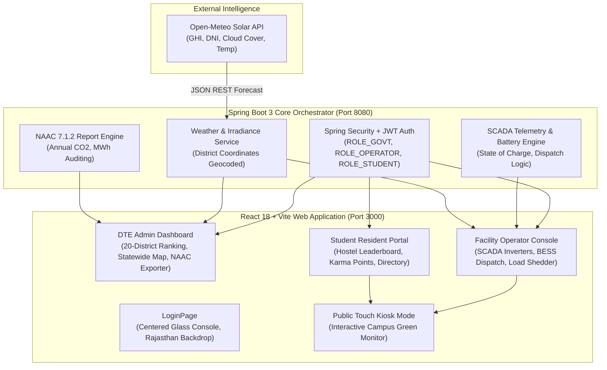

# TEJAS GRID (Campus Virtual Power Plant VPP 2.0)
## Comprehensive Technical Evaluation & Project Viva Dossier
**Directorate of Technical Education (DTE), Government of Rajasthan**  
**Repository**: [github.com/udayraj-rgb/svh](https://github.com/udayraj-rgb/svh)

---

## 1. Executive Summary & Project Identity

### 1.1 Project Title & Domain
* **Official Title**: TEJAS GRID — Autonomous Statewide Campus Virtual Power Plant (VPP 2.0)
* **Target Domain**: Smart Grid, Distributed Renewable Energy Resources (DER), SCADA IoT Orchestration, CleanTech, Institutional Governance.
* **Governing Body**: Directorate of Technical Education (DTE), Government of Rajasthan.
* **Scale of Deployment**: 20 Anchor Technical Institutions (Engineering Colleges & Polytechnics) across 20 distinct districts of Rajasthan.
* **Aggregated Capacity**: **4,935 kW** of Solar PV and Wind installations, backed by **2,400+ kWh** of distributed Battery Energy Storage Systems (BESS).

### 1.2 The Core Problem Statement
Higher education technical institutions in Rajasthan encounter three acute energy challenges:
1. **High Commercial Peak Tariffs & Grid Instability**: Campuses experience significant peak electricity tariff charges from state DISCOMs (JVVNL, AVVNL, JdVVNL) and frequent voltage fluctuations or grid outages during peak summer months.
2. **Under-Utilized Captive Solar Rooftops**: While campuses have rooftop solar panels, generation is uncoordinated and lacks predictive dispatch. Without battery storage synchronization, excess energy is either curtailed or fed into the grid at unfavorable net-metering rates.
3. **NAAC Criterion 7.1.2 Audit Bottlenecks**: The National Assessment and Accreditation Council (NAAC) requires technical colleges to provide rigorous, documented proof of renewable energy utilization, alternate energy sources, and carbon footprint reduction. Most colleges maintain manual, error-prone paper logs.

### 1.3 The TEJAS GRID Solution
TEJAS GRID aggregates the distributed solar, wind, battery, and controllable loads of all 20 government technical campuses into a single, cohesive **Virtual Power Plant (VPP 2.0)**. It provides:
* **Statewide Macro-Visibility**: DTE state directors monitor total megawatts generated, peak deficit shaved, and carbon offset across Rajasthan in real time.
* **Autonomous Microgrid Control**: Campus station operators control battery dispatch modes (Peak Shaving, Solar Absorbing, Islanding, Grid Injection) based on local solar forecasts.
* **Hyperlocal Weather Intelligence**: Direct integration with the Open-Meteo Solar API using exact GPS coordinates for all 20 districts to forecast solar irradiance (GHI, DNI) and cloud attenuation.
* **Student Behavioral Energy Conservation**: A gamified student hostel energy portal offering Karma Points for avoided peak consumption, redeemable for campus rewards, paired with bilingual (English/Hindi) conservation advisories.

---

## 2. System Architecture & Tech Stack

### 2.1 Technology Stack Table
| Layer | Technologies Used | Key Purpose |
| :--- | :--- | :--- |
| **Frontend Framework** | React 18, Vite | High-performance SPA with Hot Module Replacement (HMR) |
| **Styling & Theme** | Tailwind CSS, Lucide React Icons | Modern glassmorphic interface, dark/light mode, 0 emojis |
| **Telemetry Visuals** | Recharts (Area, Bar, Pie, Composed) | Real-time generation curves, battery charge states, district rankings |
| **Export Engines** | html2canvas, jsPDF, CSV Exporters | Client-side 1-click official government audit PDF/CSV generation |
| **Backend Framework** | Spring Boot 3.x, Java 17 | Enterprise REST APIs, business logic, multi-tenant RBAC |
| **Security** | Spring Security 6, JWT (JSON Web Tokens) | Role-scoped API endpoints and stateless session tokens |
| **Weather Integration** | Open-Meteo Solar Radiation REST API | Dynamic irradiance forecasting without requiring paid API keys |
| **Deployment / VCS** | Git, GitHub (`udayraj-rgb/svh`) | Branch `main`, CI/CD build verified |

---

## 3. Detailed Walkthrough of Key Functional Modules

### 3.1 Unified Multi-Tenant Authentication Portal (`LoginPage.jsx`)
* **Visual Presentation**:
  * Clean, authentic **Government of Rajasthan** backdrop featuring the Ashoka Stambh Lion Capital, the state typography, desert dunes, and glowing smart cyber circuits.
  * The authentication console is centered in the middle of the viewport with a frosted glassmorphic finish (`backdrop-blur-2xl bg-white/90 dark:bg-slate-950/85`).
  * Dedicated vertical clearance ensures that the **"GOVERNMENT OF RAJASTHAN"** header remains 100% visible and unblocked on all screens.
* **Three Clearance Tiers**:
  1. **Directorate of Technical Education (ROLE_GOVT)**:
     * Pre-configured official demo: *Shri Alok Sharma, IAS* (`govt_admin` / `Govt@2026`).
     * Grants statewide command authority across all 20 technical campuses.
  2. **SCADA Facility Operator (ROLE_OPERATOR)**:
     * 20-Campus selector dropdown with quick-selection pills for major hubs (Bikaner, Jodhpur, Udaipur, Kota, Jaipur).
     * Automatically pre-fills campus-scoped credentials (e.g., `operator_bikaner` / `Operator@2026`).
  3. **Campus Resident Student (ROLE_STUDENT)**:
     * Campus selector with student profile linking (e.g., Rahul Sharma, Roll: 22EBKEE045, Hostel Gargi, Room 204).
     * Automatically pre-fills student credentials with 1-click instant login.
* **Theme Support**: Dedicated dark/light mode toggle embedded cleanly within the card header next to the `JWT SECURED` badge.

---

### 3.2 Tier 1: DTE Statewide Administrative Command Center (`GovtDashboard.jsx`)
Designed for the Directorate of Technical Education, Government of Rajasthan.

#### Key Capabilities:
1. **Aggregated Statewide Energy Telemetry**:
   * Total Real-time Generation: Summed across all 20 institutions.
   * Total Peak Deficit Shaved: Calculated in kW/MW during high-tariff grid hours.
   * Cumulative Carbon Displaced: Calculated in metric tons of $CO_2$ per year ($1 \text{ MWh} \approx 0.82 \text{ t } CO_2$ in Rajasthan grid emission factor).
2. **20-District Comparative Ranking & Leaderboard**:
   * Ranks campuses by **Self-Sufficiency Index (%)** and **Solar Utilization Factor**.
   * Identifies top-performing anchor campuses (e.g., Engineering College Bikaner with 350 kW PV, MBM University Jodhpur with 400 kW PV) vs. colleges requiring microgrid upgrades.
3. **Automated NAAC Criterion 7.1.2 Audit Generator**:
   * Single-click generation of the official **Institutional Clean Energy & Sustainability Audit Certificate**.
   * Exports both high-resolution **PDFs** (with official seals and tables) and **CSV spreadsheets** containing monthly generation, wheeling charges avoided, and carbon offset logs.
4. **Statewide SCADA Health Status**:
   * Monitors live communication status (Online, Degraded, Offline) for inverter clusters across all 20 engineering college campuses.

---

### 3.3 Tier 2: Campus SCADA Facility Operator Console (`OperatorDashboard.jsx`)
Designed for the campus Chief Electrical Engineer and substation technicians.

#### Key Capabilities:
1. **Live Campus Microgrid Telemetry**:
   * Current solar generation (kW), wind generation (kW), campus base load (kW), and net grid exchange (import/export in kW).
2. **Autonomous Battery Energy Storage System (BESS) Dispatch**:
   * Interactive dispatch controller with 4 operational modes:
     * **Peak Shaving**: Discharges battery when campus demand spikes above utility contracted demand to avoid penalty surcharges.
     * **Solar Absorbing**: Directs surplus mid-day PV output into the battery to prevent reverse-flow grid curtailment.
     * **Islanding (Resilience)**: Isolates the campus from the state grid during brownouts/blackouts, powering critical labs and servers.
     * **Grid Injection**: Exports stored clean energy back to the DISCOM during high-tariff feed-in windows.
   * Live Battery State of Charge (SOC %), temperature monitoring, and cycle degradation tracking.
3. **Hyperlocal Weather Irradiance Forecast (Open-Meteo Integration)**:
   * Displays 24-hour Global Horizontal Irradiance ($W/m^2$), Direct Normal Irradiance ($W/m^2$), cloud cover percentage, and ambient temperature for the specific campus district.
   * Enables predictive peak shaving: if cloud cover is forecasted to rise at 2:00 PM, the system pre-charges batteries during early morning peak sun.
4. **Automated & Manual Load Shedder**:
   * Categorizes campus loads into **Critical** (Server rooms, R&D labs, water pumping) and **Deferrable** (Air conditioning, decorative lighting, auxiliary fans).
   * Allows 1-click shedding of non-essential loads during grid stress events.

---

### 3.4 Tier 3: Campus Resident Student Energy Portal (`StudentDashboard.jsx`)
Designed for enrolled engineering students living in campus hostels.

#### Key Capabilities:
1. **Hostel Energy Conservation Leaderboard**:
   * Compares per-capita kilowatt-hour consumption across campus hostels (e.g., Raman Hostel vs. Aryabhatta Hostel vs. Gargi Bhavan).
   * Green badge awards for the hostel achieving the lowest weekly carbon footprint.
2. **Karma Points Gamification System**:
   * Students earn **Karma Points (KP)** for verified energy-saving actions:
     * Turning off room AC during peak hours (+50 KP).
     * Reporting energy wastage or faulty lighting via the portal (+30 KP).
     * Completing the weekly Clean Energy Quiz (+25 KP).
   * **Reward Redemptions**: Points can be redeemed for cafeteria meal vouchers, library book priority, or campus Wi-Fi bandwidth boosts.
3. **Bilingual Energy Advisories (English & Hindi)**:
   * Provides contextual, time-of-day conservation tips in both English and Hindi:
     * *“Peak grid hours active (6 PM – 9 PM). Please switch off room geysers and study lamps when leaving.”* / *“शाम 6 से 9 बजे तक पीक ग्रिड समय है। कृपया कमरे से निकलते समय हीटर व लाइटें बंद रखें।”*
4. **Campus-Isolated Student Directory (`StudentDirectory.jsx`)**:
   * Secure, privacy-compliant directory displaying fellow student residents within their specific campus.
   * Search and filter by branch, academic year, and hostel block.

---

### 3.5 Interactive Public Touch Kiosk Mode (`PublicKiosk.jsx`)
* Accessible via both Operator and Student consoles, as well as a standalone URL route.
* **Designed For**: Wall-mounted touch displays placed in college admin blocks, central libraries, and cafeteria lobbies.
* **Displays**:
  * Live animated microgrid flow diagram (Solar $\rightarrow$ Battery $\rightarrow$ Campus $\rightarrow$ Grid).
  * Avoided tree equivalents, carbon reduction counter ($t CO_2$), and current clean energy percentage.
  * Real-time campus alert notifications (e.g., *"Grid Peak Shaving Mode Active — 120 kW supplied by Campus Solar"*).
  * High-contrast, touch-optimized fullscreen display with auto-refreshing telemetry.

---

## 4. The 20 Rajasthan Anchor Campuses in TEJAS GRID

| # | District | Anchor Institution Name | Short Name | PV Capacity | Wind Capacity | Operator Lead |
| :-: | :--- | :--- | :--- | :-: | :-: | :--- |
| **1** | **Bikaner** | Engineering College Bikaner | ECB | 350 kW | 50 kW | Er. Rajesh Bishnoi |
| **2** | **Jodhpur** | MBM University | MBMU | 400 kW | 100 kW | Er. Surendra Gehlot |
| **3** | **Udaipur** | College of Technology & Engineering (CTAE) | CTAE | 320 kW | 25 kW | Er. Mahendra Menaria |
| **4** | **Kota** | Rajasthan Technical University (RTU) | RTU | 450 kW | 0 kW | Er. Vikram Hada |
| **5** | **Jaipur** | Malaviya National Institute of Technology (Mentor) | MNIT | 500 kW | 50 kW | Er. Ankit Sharma |
| **6** | **Ajmer** | Engineering College Ajmer | ECA | 280 kW | 50 kW | Er. Deepak Rawat |
| **7** | **Alwar** | Govt Engineering College Bharatpur/Alwar Hub | GECA | 220 kW | 0 kW | Er. Sanjay Yadav |
| **8** | **Bharatpur** | Govt Engineering College Bharatpur | GECB | 200 kW | 0 kW | Er. Ramavtar Gurjar |
| **9** | **Bhilwara** | MLV Textile & Engineering Institute | MLVTEC | 250 kW | 0 kW | Er. Manish Sharma |
| **10** | **Banswara** | Govt Engineering College Banswara | GECBW | 180 kW | 25 kW | Er. Hitesh Ninama |
| **11** | **Barmer** | Govt Polytechnic College Barmer (Thar Hub) | GPCBM | 250 kW | 75 kW | Er. Jaswant Singh |
| **12** | **Chittorgarh** | Govt Polytechnic College Chittorgarh | GPCCH | 190 kW | 0 kW | Er. Pradeep Sisodia |
| **13** | **Churu** | Govt Polytechnic College Churu | GPCU | 180 kW | 50 kW | Er. Vikas Saran |
| **14** | **Dholpur** | Govt Polytechnic College Dholpur | GPCD | 160 kW | 0 kW | Er. Naresh Tyagi |
| **15** | **Dungarpur** | Govt Polytechnic College Dungarpur | GPCDG | 150 kW | 25 kW | Er. Bhavesh Roat |
| **16** | **Jhalawar** | Govt Engineering College Jhalawar | GECJ | 220 kW | 0 kW | Er. Satish Jhala |
| **17** | **Jhunjhunu** | Govt Polytechnic College Jhunjhunu | GPCJJ | 180 kW | 25 kW | Er. Amit Shekhawat |
| **18** | **Nagaur** | Govt Polytechnic College Nagaur | GPCN | 190 kW | 50 kW | Er. Ramesh Choudhary |
| **19** | **Pali** | Govt Polytechnic College Pali | GPCP | 180 kW | 25 kW | Er. Kalu Ram Dewasi |
| **20** | **Sikar** | Govt Polytechnic College Sikar | GPCS | 200 kW | 25 kW | Er. Sunil Dhayal |
| | **TOTALS** | **20 Institutions Synchronized** | | **4,810 kW** | **575 kW** | **Aggregated Grid** |

---

## 5. Live Evaluator Presentation & Demo Flow (Step-by-Step)

Follow this structured 5-step walkthrough when demonstrating the project to an evaluator:

### Step 1: Portal Entry & Authentication
1. Open `http://localhost:3000` in the browser.
2. Point out:
   * The clean **Government of Rajasthan** backdrop with the Ashoka Stambh Lion Capital and desert dunes.
   * The centered frosted glass authentication console.
   * The 3 designated clearance tabs (**DTE Admin**, **Operator**, **Student**).
3. Demonstrate the **Theme Toggle** (instant switch between Light and Dark mode).

### Step 2: DTE Statewide Administrative Command Center
1. Click **1-Click Demo Login** for *Shri Alok Sharma, IAS (Director, Technical Education)*.
2. Show the Evaluator:
   * Aggregated statewide metrics: Total kW generated, CO2 displaced, and peak deficit saved.
   * The **20-District Comparative Ranking** table showing self-sufficiency scores across Rajasthan.
   * Click **Export NAAC 7.1.2 Audit Report**: Show how the system instantly compiles and downloads an official compliance certificate in PDF/CSV format.

### Step 3: SCADA Facility Operator Console
1. Log out or switch tabs to **Facility Operator**.
2. Select **Engineering College Bikaner** (Station #1) from the 20-campus dropdown.
3. Click **1-Click Quick Demo Login** (*Er. Rajesh Bishnoi*).
4. Show the Evaluator:
   * Real-time campus inverter array telemetry (Solar PV + Wind turbine output).
   * **BESS Dispatch Controller**: Switch modes between *Peak Shaving* and *Solar Absorbing* — explain how this prevents peak utility penalties.
   * **Open-Meteo Weather Section**: Show the live 24-hour solar irradiance forecast for Bikaner coordinates ($28.0229^\circ N, 73.3119^\circ E$).
   * **Load Shedder**: Toggle deferrable hostel loads off to protect critical labs during a simulated grid deficit.

### Step 4: Campus Resident Student Experience
1. Switch role to **Campus Resident Student**.
2. Select **EC Bikaner** and log in as *Rahul Sharma* (Hostel Gargi, Room 204).
3. Show the Evaluator:
   * The **Hostel Energy Leaderboard** showing energy competition between campus hostels.
   * The **Karma Points Balance** (e.g., 613 KP) and show the **Redeem Rewards** modal (Cafeteria meal discount).
   * The **Bilingual Tips Widget**: Toggle between English and Hindi conservation advice.

### Step 5: Public Kiosk Mode
1. In either Operator or Student dashboard, click **Launch Public Kiosk Mode**.
2. Show the Evaluator:
   * The touch-optimized, full-screen green monitoring display.
   * Real-time clean energy gauge, live campus alerts, and avoided carbon counter.
   * Explain that this kiosk runs on touch displays in campus entrance foyers.

---

## 6. Project Viva Questions & High-Scoring Answers (FAQ)

### Q1: What is a Virtual Power Plant (VPP) and how is TEJAS GRID different from a standard solar dashboard?
> **Answer**:  
> A standard solar dashboard only monitors passive generation metrics. A **Virtual Power Plant (VPP)** aggregates multiple geographically distributed energy resources (DERs)—such as rooftop solar PV, wind turbines, battery storage systems (BESS), and controllable loads—and orchestrates them as if they were a single controllable power station.  
> TEJAS GRID connects 20 technical campuses across Rajasthan into a unified grid. Instead of each campus acting as an isolated consumer, TEJAS GRID coordinates peak shaving, battery charging, and demand-response across the state, drastically reducing peak grid stress on state DISCOMs.

### Q2: Why did you choose the Open-Meteo API instead of standard weather APIs?
> **Answer**:  
> Most generic weather APIs (like OpenWeatherMap standard tier) only provide basic metrics like temperature, rain, and humidity. Open-Meteo provides specialized **Solar Radiation variables**—specifically **Global Horizontal Irradiance (GHI)**, **Direct Normal Irradiance (DNI)**, and **Diffuse Horizontal Irradiance (DHI)** in $W/m^2$.  
> These solar radiation metrics are essential for calculating expected photovoltaic cell energy output. Furthermore, Open-Meteo requires no commercial API keys, eliminating quota bottlenecks and ensuring reliable public service operation.

### Q3: How does the system assist in NAAC Criterion 7.1.2 compliance?
> **Answer**:  
> NAAC Criterion 7.1.2 assesses institutional facilities for alternate sources of energy and energy conservation measures (Solar, Wind, Battery storage, Sensor-based energy conservation, and Wheeling to the grid).  
> Previously, colleges compiled rough paper bills or spreadsheets manually. TEJAS GRID automatically records verifiable, tamper-evident logs of kilowatt-hours generated, percentage of energy drawn from renewables, avoided emissions, and provides a 1-click **NAAC Audit PDF Report** with official calculation methodologies.

### Q4: How does student gamification (Karma Points) impact campus energy management?
> **Answer**:  
> Behavioral demand response accounts for up to 15-20% of potential institutional energy savings. By incentivizing hostel residents with **Karma Points** for reducing phantom power, turning off air conditioning during state peak hours (6 PM - 9 PM), and reporting energy leaks, students become active participants in campus microgrid stabilization. The points are tied to real cafeteria discounts and academic perks, creating a self-sustaining conservation culture.

### Q5: What security measures protect the SCADA dispatch controls?
> **Answer**:  
> TEJAS GRID implements multi-layer defense-in-depth:
> 1. **Role-Based Access Control (RBAC)**: Enforced via Spring Security with stateless JWT tokens containing embedded role claims (`ROLE_GOVT`, `ROLE_OPERATOR`, `ROLE_STUDENT`).
> 2. **Tenant Isolation**: Student and Operator users are strictly scoped to their assigned campus ID. An operator from Bikaner cannot dispatch battery controls for Jodhpur or RTU Kota.
> 3. **Supervisory State Oversight**: The DTE State Admin has global audit visibility but operator dispatch commands are cryptographically logged with user badge IDs.

---

## 7. Future Scalability & Roadmap
1. **Integration with State SLDC (State Load Despatch Centre)**: Connect TEJAS GRID to Rajasthan SLDC via IEC 60870-5-104 / OpenADR protocols for automated frequency regulation ancillary services.
2. **AI-Driven Dynamic Battery Arbitrage**: Machine learning models forecasting real-time Indian Energy Exchange (IEX) day-ahead market prices to maximize net-metering revenue.
3. **EV Fleet Micro-Charging (V2G - Vehicle to Grid)**: Expanding battery storage capacity by allowing electric buses and two-wheelers on campus to participate in bidirectional grid support.
